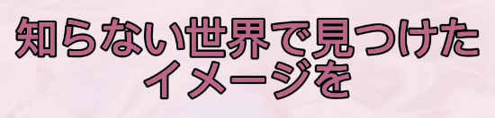
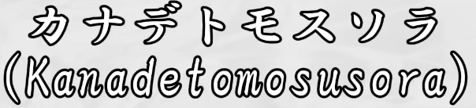
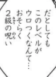
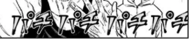
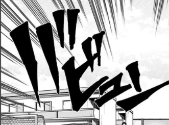
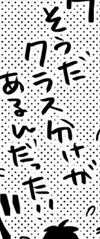

# Hayai OCR (速いOCR)

Fast optical character recognition for Japanese, Chinese, and Korean text, with the main focus being Japanese manga.
Powered by the new **Hayai OCR v2** model ([JustANormalTinkerer/hayai-ocr-v2](https://huggingface.co/JustANormalTinkerer/hayai-ocr-v2)), pairing a [SigLIP2 NaFlex](https://huggingface.co/google/siglip2-base-patch16-naflex) vision encoder with a high-performance transformer architecture.

Hayai OCR v2 is **MUCH faster** while also adding multi-language support for **Chinese** (Simplified and Traditional) and **Korean** alongside Japanese.

Hayai OCR can be used as a general purpose printed Asian language OCR, but its main goal is to provide high quality text recognition, robust against various scenarios specific to manga:
- both vertical and horizontal text
- text with furigana
- text overlaid on images
- wide variety of fonts and font styles
- low quality images
- SFX

Unlike many OCR models, Hayai OCR supports recognizing multi-line text in a single forward pass, so that text bubbles found in manga can be processed at once, without splitting them into lines.

See also:
- [Poricom](https://github.com/bluaxees/Poricom), a GUI reader
- [mokuro](https://github.com/kha-white/mokuro), a tool for generating HTML overlays for manga

# Installation

You need Python 3.9 or newer. Please note that the newest Python release might not be supported due to a PyTorch
dependency, which often breaks with new Python releases and needs some time to catch up.
Refer to [PyTorch website](https://pytorch.org/get-started/locally/) for a list of supported Python versions.

If you want to run with GPU, install PyTorch as described [here](https://pytorch.org/get-started/locally/#start-locally),
otherwise this step can be skipped.

```bash
pip install hayai-ocr
```

# Usage

## Python API

```python
from hayai_ocr import HayaiOcr

mocr = HayaiOcr()
text = mocr('/path/to/img')
```

or with PIL:

```python
import PIL.Image
from hayai_ocr import HayaiOcr

mocr = HayaiOcr()
img = PIL.Image.open('/path/to/img')
text = mocr(img)
```

Batch processing is also supported:

```python
texts = mocr(['/path/to/img1.png', '/path/to/img2.png'])
```

### Quantization (int4 / int8)

Hayai OCR supports weight-only quantization via `torchao` (PyTorch AO) to reduce VRAM usage:

- **`int8`**: INT8 weight-only — ~2x memory reduction with minimal accuracy loss
- **`int4`**: INT4 weight-only — ~4x memory reduction

```python
# Run with int4 quantization
mocr = HayaiOcr(quantize="int4")

# Run with int8 quantization
mocr = HayaiOcr(quantize="int8")
```

### LiteRT backend (no PyTorch required)

Alternative backend that runs exported TFLite graphs (encoder + prefill/decode with KV-cache) via `ai_edge_litert` — ideal for CPU / edge without PyTorch. Artefacts: [JustANormalTinkerer/hayai-ocr-v2-tflite](https://huggingface.co/JustANormalTinkerer/hayai-ocr-v2-tflite) (`litert_exports/{none,wi4,wi8_afp32,dynamic_wi4,dynamic_wi8}`).

```bash
pip install hayai-ocr[litert]  # installs ai_edge_litert, tokenizers, huggingface_hub
```

```python
from hayai_ocr import HayaiOcr

mocr = HayaiOcr(backend="litert")  # default: wi4 (int4)
mocr = HayaiOcr(backend="litert", litert_quant="dynamic_wi4")  # dynamic int4
mocr = HayaiOcr(backend="litert", litert_quant="float")  # fp32
# local exports: HayaiOcr(backend="litert", litert_model_path="/path/to/litert_exports/dynamic_wi4")
```

Quants: `none`/`float`, `wi4`/`int4`, `wi8_afp32`/`int8`, `dynamic_wi4`/`dynamic_int4`, `dynamic_wi8`/`dynamic_int8`. Override HF repo with `litert_repo`.

CLI: `hayai_ocr --backend litert --litert-quant dynamic_wi4`

### Legacy v1 Model Fallback

If you need to use the legacy Hayai OCR v1 model (`JustANormalTinkerer/hayai-ocr`), you can set `use_v1=True` or supply the v1 model repository:

```python
# Use the legacy v1 model
mocr = HayaiOcr(use_v1=True)
```

> **Note:** The backwards-compatible `MangaOcr` alias is still available:
> ```python
> from hayai_ocr import MangaOcr
> mocr = MangaOcr()
> ```

## Running in the background

Hayai OCR can run in the background and process new images as they appear.

You might use a tool like [ShareX](https://getsharex.com/) or [Flameshot](https://flameshot.org/) to manually capture a region of the screen and let the
OCR read it either from the system clipboard, or a specified directory. By default, Hayai OCR will write recognized text to clipboard,
from which it can be read by a dictionary like [Yomitan](https://github.com/yomidevs/yomitan).

Clipboard mode on Linux requires `wl-copy` for Wayland sessions or `xclip` for X11 sessions. You can find out which one your system needs by running `echo $XDG_SESSION_TYPE` in the terminal.

Your full setup for reading manga with a dictionary might look like this:

capture region with ShareX -> write image to clipboard -> Hayai OCR -> write text to clipboard -> Yomitan

- To read images from clipboard and write recognized texts to clipboard, run in command line:
    ```commandline
    hayai_ocr
    ```
- To run with quantization in CLI:
    ```commandline
    hayai_ocr --quantize int4
    ```
- To run with the legacy v1 model:
    ```commandline
    hayai_ocr --use-v1
    ```
- To read images from ShareX's screenshot folder, run in command line:
    ```commandline
    hayai_ocr "/path/to/sharex/screenshot/folder"
    ```
Note that when running in the clipboard scanning mode, any image that you copy to clipboard will be processed by OCR and replaced
by recognized text. If you want to be able to copy and paste images as usual, you should use the folder scanning mode instead
and define a separate task in ShareX just for OCR, which saves screenshots to some folder without copying them to clipboard.

When running for the first time, downloading the model might take a few minutes.
The OCR is ready to use after `OCR ready` message appears in the logs.

- To see other options, run in command line:
    ```commandline
    hayai_ocr --help
    ```

If `hayai_ocr` doesn't work, you might also try replacing it with `python -m hayai_ocr`.

## Usage tips

- OCR supports multi-line text, but the longer the text, the more likely some errors are to occur.
  If the recognition failed for some part of a longer text, you might try to run it on a smaller portion of the image.
- The model was trained to handle manga, visual novels, anime graphics, and handwritten texts across Japanese, Chinese, and Korean.
- The model always attempts to recognize some text on the image, even if there is none.
  Because it uses a transformer decoder (and therefore has some language model understanding),
  it might even "dream up" realistically looking sentences! This shouldn't be a problem for most use cases.

# Examples

Here are some examples showing the capability of the model with the new **Hayai OCR v2**: 

Note: All the example images are picked randomly from Youtube videos and raw manga sites. The model has never seen these images before.
Some images (especially the youtube ones) weren't even in the scope of this project, but the model is just that good at it.  

| image | hayai-ocr-v1 | hayai-ocr-v2 | hayai-ocr-v2.1 | PaddleOCR-VL For Manga |
|---|---|---|---|---|
|  | 知らない世界で見つけたイメージを | 知らない世界で見つけたイメージを | 知らない世界で見つけたイメージを | 知らない世界で見つけた\n イメージを |
|  | カナデトモスソラ（Ｋａｎａｄｅｔｏｍｏｓｕｓｏｒａ） | カナデトモスツラ(Kanadetomosusora) | カナデトモスソラ(Kanadetomosusura) | カナデトモスリラ(Kanadetomosusora) |
|  | 建設会社社員行方 | 建設会社社員行才 | 建設会社社員行方 | 建設会社社員行 |
|  | だとしてもこのレベルがウロつくなんて．．．おそらく２級の呪い | だとしてもこのレベルがウロつくなんて...おそらく2級の呪い | だとしてもこのレベルがウロつくなんて...おそらく2級の呪い | だとしてもこのレベルがウロつくなんて･･･おそらく２級の呪い |
|  | パチパチパチパチ | パチパチパチパチパチパチ | パチパチパチパチ | アデアデデアデデアデ |
|  | バビュン | バビュン | バビュン | 川ビュン |
|  | 僕の過去とか未来とか | 僕の過去とか未来とか | 僕の過去とか未来とか | 僕の過去とか未来とか |
|  | くらべられっ子 | らぺろれっ子 | くらべられっ子 | くらべられっ子 |
|  | そうだクラス分けがあるんだった！！ | そうだクラス分けがあるんだった!! | そうだクラス分けがあるんだ!! | そうだクラス分けがあるんだった！！ |
|  | 脇役よ、主役を超えよ！ | 脇役よ、主役を超えよ! | 脇役よ、主役を超えよ! | 脇役よ、主役を超えよ! |
|  | Ｅｈ～Ｉｄｏｎ＇ｔｒｅａｌｌｙｗａｎｔｔｏ～ | Eh~I don't really want to~ | Eh~ I don't really want to~ | Ｅｈ～Ｉ don't really want to～ |
|  | 「Ｓｏｒｒｙｆｏｒｔｈｅｗａｉｔ～！Ｄｉｄｙｏｕｗａｉｔｌｏｎｇ？」 | 「Sorry for thewait~!DidyouwaitLong?」 | 「Sorry for the wait~! Did you wait Long?」 | 「Sorry for the wait~!Did you wait long?」 |
|  | ＹａｍａｔｅＡｒｅａＮｅｗｒｅｓｉｄｅｎｔｉａｌｄｉｓｔｒｉｃｔｆｏｒｆｏｒｅｉｇｎｅｒｓ | Yamate AreaNew residental district forforeignert | Yamate Area New residential district for foreigners | Yamate Area New residential district for foreigners |


## Benchmarks:


#### [JMangaBench_Mixed](https://github.com/muscgab/JMangaBench_Mixed/)

| Model | CER ↓ (Lower is Better)| Exact match ↑ (Higher is better) | Text-only CER ↓ | Text-only exact match ↑ |
|---|---:|---:|---:|---:|
| MangaOCR | 4.683% | 73.524% | 2.700% | 82.867% |
| HayaiOCR | 6.738% | 71.272% | 4.967% | 80.949% |
| HayaiOCR-v2 | 4.534% | 73.645% | 2.872% | 82.227% |
| **HayaiOCR-v2.1** | **3.225%** | **79.671%** | **1.896%** | **87.461%** |
| **HayaiOCR-v2.1 (LiteRT dynamic int4)** | 3.959% | 75.533% | 2.560% | 83.414% |
| BaberuOCR | 4.589% | 72.246% | 2.603% | 81.649% |
| PaddleOCR-VL-0.9B-For-Manga | 2.910% | 78.911% | 1.866% | 84.662% |

> [!NOTE]
> The previous version of this readme contained a note stating that the benchmark was bad, however, upon further examination, I believe it holds up.

#### [My finetuning Dataset Train Split: Chinese + Japanese/Korean Onomatopoeia + Some English](JustANormalTinkerer/hayai-finetuning-dataset)

| Model Name | Mean CER | Throughput on L4 GPU (FPS) |
| :--- | ---: | ---: |
| Hayai OCR v2 | 8.52% | 37.25 |
| PaddleOCR-VL-For-Manga | 24.66% | 3.60 |


#### Private Pretraining Dataset Train Split: CJK

| Model Name | Mean CER | Throughput on L4 GPU (FPS) |
| :--- | ---: | ---: |
| Hayai OCR v2 | 10.56% | 31.95 |
| Hayai OCR v2.1 | 12.94% | 54.22* |
| PaddleOCR-VL-For-Manga | 38.69% | 2.22 |

*No idea how the throughput increased so much

## Goals

While PaddleOCR-VL is also very accurate, it is 9x the size of this model and it struggles with SFX. The goal of this model is not to be State of the Art, but rather be usuable and fast at scale.

# Acknowledgments

This project is a fork of [manga-ocr](https://github.com/kha-white/manga-ocr) by [kha-white](https://github.com/kha-white).

Training data included:
- [Manga109-s](http://www.manga109.org/en/download_s.html) dataset
- [jawildtext](https://huggingface.co/datasets/llm-jp/jawildtext) dataset
- [AnimeText](https://huggingface.co/datasets/deepghs/AnimeText) dataset
- Additional synthetic and cropped manga datasets
